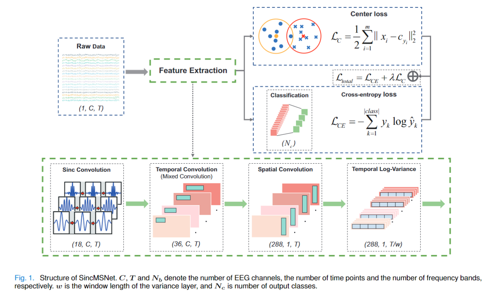
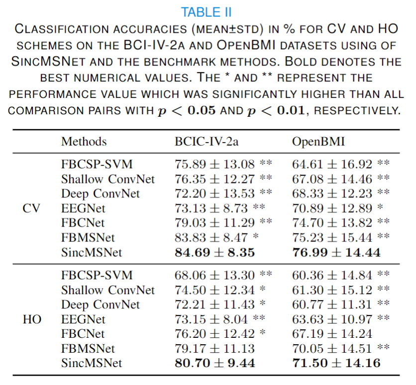

# SincMSNet

## SincMSNet: A Sinc Filter Multi-Scale Convolutional Neural Network for EEG-Based Motor Imagery Decoding

This is the PyTorch implementation of the SincMSNet architecture for EEG-MI classification. 

# SincMSNet: Architecture

SincMSNet consists of five blocks, (1) a Sinc convolution block, (2) a temporal convolution block, (3) a spatial convolution block, (4) a temporal log-variance block, and (5) a fully connected layer for classification. The first block employs the sinc filter, which uses only two cut-off frequencies as trainable parameters to learn a band-pass filter. The second block is designed to learn the multiscale temporal information from the multiview EEG representations, and the third block aims to learn the spatial information from each temporal feature map. Subsequently, the Fourth block computes the temporal variance of each time series. Finally, all representations are flattened and fed to the fully connected layer with softmax as the activation function. An overview of FBMSNet is depicted in Fig. 1.

Furthermore, to distinguish similar categories in a better way and decrease the influence of interclass dispersion and within-class variance, we not only minimize the cross entropy (CE) loss function but also introduce the center loss function. With this joint supervision, SincMSNet is capable of learning deep features with two key learning objectives as much as possible, interclass separability and intraclass compactness as much as possible, which are crucial to MI recognition

## How to use

The package requirements to run all the codes are provided in file environment.txt. The complete instructions for utilising this toolbox are provided in instructions.txt.

## SincMSNet : Results

The classification results for SincMSNet and other competing architectures are as follows:

## References:

*Ravikiran Mane, Effie Chew, Karen Chua, Kai Keng Ang, Neethu Robinson, A.P. Vinod, Seong-Whan Lee, and Cuntai Guan, **"FBCNet: An Efficient Multi-view Convolutional Neural Network for Brain-Computer Interface,"** arXiv preprint arXiv:2104.01233 (2021) https://arxiv.org/abs/2104.01233*

## Acknowledgment

We thank Ravikiran Mane et al. for their useful [toolbox](https://github.com/ravikiran-mane/FBCNet). 